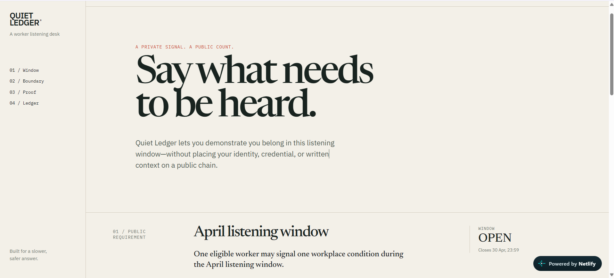
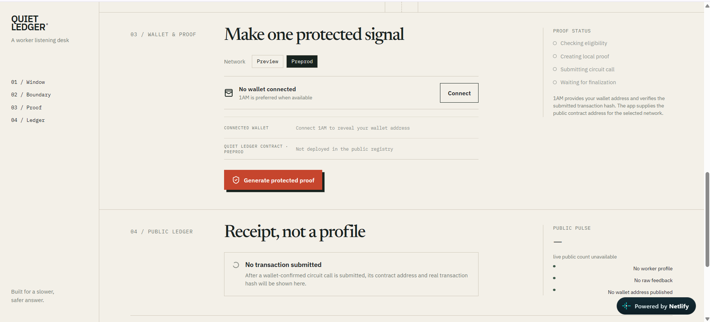
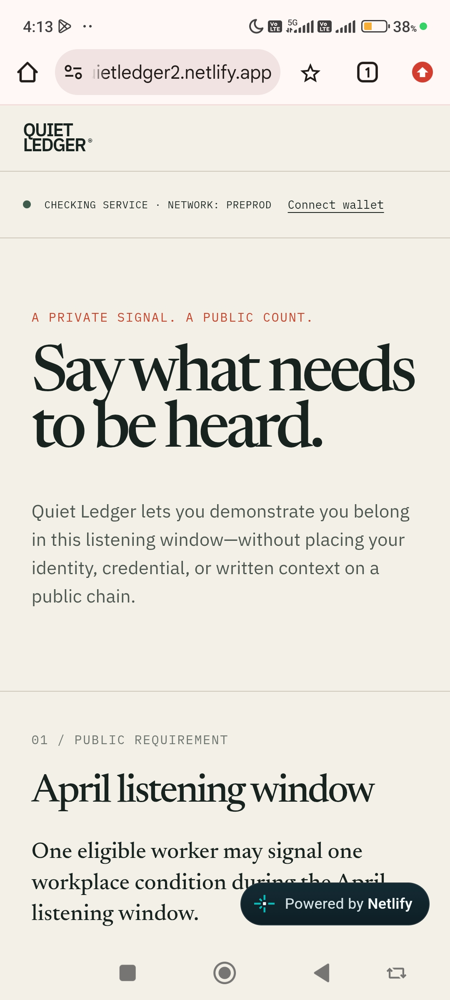
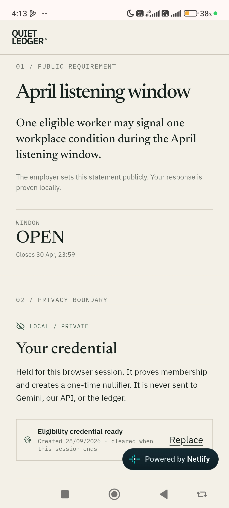
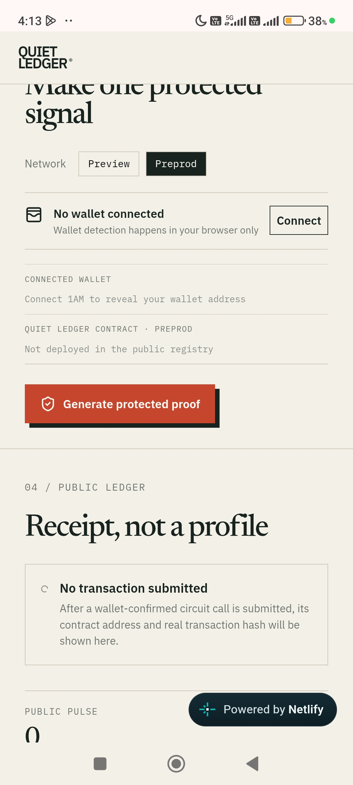

# Quiet Ledger

[](https://github.com/OWNER/quiet-ledger/actions/workflows/ci.yml)

Quiet Ledger is a worker-first privacy DApp for time-bounded workplace listening. A worker proves that they are eligible and have not already participated in the current window, without publishing an identity, credential, wallet address, raw note, or private response.

> **Status:** live on Netlify with verified personal contract deployments on Midnight Preview and Preprod.

## Live Working Website

[Open the live Quiet Ledger website](https://quietledger2.netlify.app/)

## Demo Video URL

[Watch the Quiet Ledger demo video](https://drive.google.com/file/d/1-wiND1avJ1Sg6gV89jT2I-emVvc3tnLC/view?usp=sharing)

## Preprod

### Deployed Contract Address

`168f8534d266874dac44f04026920a57b93c7b1ec213008122b44d1e71197725`

### Transaction Hash

`e5d641c381bf9ce2eeadb0e2c517c5c16fa181dcdc74cf89755a7f6d665d93ab`

## Preview

### Deployed Contract Address

`403c8a2b08360a6e45ae7095fd33afc15741e70912423d6c3479a392c38b2f07`

### Transaction Hash

`0255d7669186f98a50dd787d2f75f667bc9847c12c5872dfb9774a1fc6dd8278`

## Live Website Screenshots

### Worker-first landing page



### Wallet and protected-proof experience



## Mobile Responsive UI

<p align="center">
  
  
  
</p>

## Why Midnight

Traditional feedback tooling centralizes the identity trail that makes honest participation risky. Midnight lets the contract check a local witness against public eligibility commitments and preserve a one-signal-per-window rule using a scoped nullifier. The chain can verify a valid aggregate signal while not learning the worker or their raw data. See [the privacy model](docs/PRIVACY_MODEL.md).

## Architecture

React/Vite renders the worker flow and keeps temporary credential material in browser session storage. The 1AM-preferred DApp Connector integration discovers UUID-keyed providers from `window.midnight`, resets the session on network change, and lets each worker deploy a personal Compact contract before submitting a signal. FastAPI stores public receipt metadata and public policy hashes only. Gemini receives sanitized public policy text and produces structured explanations with a deterministic fallback. See [architecture](docs/ARCHITECTURE.md).

## Stack

- React 19, TypeScript, Vite, Framer Motion and accessible responsive CSS
- Midnight DApp Connector API v4.0.1, Midnight.js v4.1.1, Compact language 0.23/toolchain 0.31.1
- FastAPI, SQLAlchemy async, Alembic, Pydantic, asyncpg and Neon/Lakebase Postgres
- Official Google GenAI Python SDK with Pydantic structured output
- GitHub Actions, Netlify frontend hosting, Render Docker hosting, and Neon/Lakebase Postgres

## Local setup

Prerequisites: Node 22, Python 3.11+, [uv](https://docs.astral.sh/uv/), Docker Desktop, a Midnight wallet (1AM preferred), and Compact toolchain 0.31.1 (language 0.23).

```bash
cp .env.example .env
npm ci
npm run dev
uv sync --project backend --all-groups
uv run --directory backend uvicorn app.main:app --reload --port 8000
```

For development SQLite is automatic. For Neon, set `DATABASE_URL` to the pooled URL for API traffic and `DATABASE_URL_UNPOOLED` to the direct URL for Alembic. Link a Neon project, create `production` and `development` branches, run migrations against development, then promote after review. Do not commit either URL.

```bash
cd backend
DATABASE_URL_UNPOOLED="$DATABASE_URL_UNPOOLED" alembic upgrade head
```

## Compact and proof server

The contract source is [contracts/quiet-ledger.compact](contracts/quiet-ledger.compact). It has public eligibility commitments, window state, nullifiers, and an aggregate counter; its witnesses stay local. Compile it with the verified Compact toolchain and commit the emitted `contracts/managed/contract`, `zkir`, and proving key artifacts for browser deployment:

```bash
npm run contract:check
npm run contract:compile
docker compose -f docker-compose.proof.yml up -d
```

The proof server listens on port 6300. It must be local or a machine you control; it processes private witness data. 1AM can use its in-browser proving provider; other compatible wallets may require the proof server. The UI never reports a successful chain transaction without the wallet returning a real transaction ID.

## Wallet connection

Open the app with the wallet extension enabled. Select Preview or Preprod, then press **Connect** directly; wallets may reject popups that are not triggered by a click. Quiet Ledger prefers 1AM when it is present but lets the worker select a compatible discovered provider. Switching networks clears the session by design.

## Gemini configuration

Set `GEMINI_API_KEY` and optionally `GEMINI_MODEL` on the API server only. The assistant receives a public policy phrase after redaction and returns a Pydantic-validated explanation. Missing keys, sensitive patterns, or SDK errors use the deterministic local plan. It never receives private witnesses, holder secrets, wallet addresses, raw credentials, identity documents, exact values, or feedback.

## Verification

```bash
npm run lint
npm test
npm run build
npm run contract:check
uv run --project backend ruff check .
uv run --directory backend pytest
```

## CI/CD

`.github/workflows/ci.yml` runs linting, frontend tests/build, backend lint/tests, Compact compilation and generated-artifact validation on every push and pull request. Connect Netlify and Render to the verified Git branch only after CI is green; no live deployment is claimed until both platforms report a successful production deploy.

## Netlify and Render deployment

Netlify builds the Vite application from `netlify.toml` and publishes `dist`. Set `VITE_API_BASE_URL` to the public Render service origin before building. The Netlify build pins Compact toolchain 0.31.1, compiles the contract, and publishes the generated browser artifacts. One frontend supports both Preview and Preprod; each connected worker creates their own network-specific contract through 1AM. The SPA rewrite keeps `/guide` and `/privacy` available on direct navigation.

Render builds `Dockerfile.backend` on the free web-service plan declared in `render.yaml`. The container runs Alembic before starting FastAPI, serves on Render's assigned port, and verifies `/health`. Configure the pooled Neon URL as `DATABASE_URL`, the direct Neon URL as `DATABASE_URL_UNPOOLED`, and the exact Netlify origin as `CORS_ORIGINS`. Production refuses SQLite and wildcard CORS. See the complete [deployment guide](docs/DEPLOYMENT.md).

## Repository structure

```text
contracts/   Compact source and generated deployment artifacts
src/         Responsive React worker experience and wallet boundary
backend/     FastAPI, async public-metadata store, Gemini safety service
docs/        Proposal, architecture, privacy model and demo script
.github/     Continuous verification workflow
```

## Known limitations

- Contract deployment and transaction submission require a compatible wallet, user approval, and sufficient network funds.
- Netlify compiles the Compact source during its Linux build and publishes the generated browser artifacts; native Windows development still requires WSL or another Linux environment for local Compact compilation.
- The product intentionally does not collect raw feedback. A future encrypted off-chain message channel would need a separate threat model and key-management review.
- Session storage narrows browser retention but is not a hardware security boundary. Production credentials should ultimately be held and proved by the selected wallet / credential issuer integration.

## Future improvements

Add independently governed encrypted message delivery, threshold-release aggregation, issuer tooling for commitments, real indexer confirmation polling, and accessibility research with workers and representatives.
